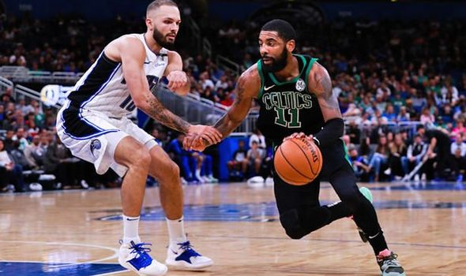

# Wins by Nets, Magic Leave three Teams on the Eastern Conference Bubble
With the Nets beating the Pacers and the Magic holding against the Celtics the playoff hunt is still on for a few teams.
The _Pistons, Hornets, and Heat_ are still in the hunt for the last playoff spot.
This could be **HUGE** for the Magic who haven't made the playoffs in seven years.

>So we really gave everything tonight, and I wouldn't have it any other way. Winning in Boston [to qualify for the playoffs] is way better than the Hornets losing in Detroit.
News around the NBA
- [Bucks get their sixtieth win](http://www.espn.com/nba/story/_/id/26467413/bucks-reach-60-win-mark-first-81)
- [Rockets set new record](http://www.espn.com/nba/recap?gameId=401071874)
- [Warriors take first seed](http://www.espn.com/nba/story/_/id/26467240/warriors-seal-west-no-1-oracle-season-finale)
